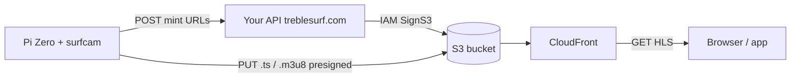

# Option B on AWS: HLS to S3

The Pi app in this repo **implements** Option B: **GStreamer `hlssink`** writes `index.m3u8` and `segment-XXXXX.ts` under `HLS_OUTPUT_DIR` (default `/tmp/surfcam-hls`), and **`HlsUploader`** + **`ApiClient::uploadLocalFileWithPresign`** push each file to S3 using **presigned PUT** URLs from your API. There is **no AWS C++ SDK** on the device.

**Related:** [SCALEWAY_MIGRATION.md](SCALEWAY_MIGRATION.md) — same upload pattern against Scaleway Object Storage if you change the presigner on the server.

### Server contract (must implement)

| Item | Value |
|------|--------|
| Method / path | `POST {API_ENDPOINT}/hls/presign` (override path with `Config::HLS_PRESIGN_PATH`) |
| Auth | `Authorization: ApiKey <API_KEY>` (same as snapshots) |
| Request JSON | `{"key":"spots/<spot_id>/live/segment-00001.ts","content_type":"video/mp2t"}` or `content_type` `application/vnd.apple.mpegurl` for `index.m3u8` |
| Response JSON | `{"url":"<presigned-PUT-url>","headers":{}}` — if `headers` is present, every key/value is sent as an HTTP header on the PUT (required for some SigV4 signatures) |
| S3 keys used by Pi | `spots/<SPOT_ID>/live/segment-#####.ts` and `spots/<SPOT_ID>/live/index.m3u8` |

---

## 1. Target architecture



- **Pi**: GStreamer writes a **local HLS directory** (`.m3u8` + `.ts`). An uploader uses **libcurl** + **presigned PUT URLs** from your API.
- **S3**: Holds objects under a prefix such as `spots/{spot_id}/live/...`.
- **CloudFront**: Serves HLS to browsers with correct **cache** rules (short for playlist, longer for segments).
- **API**: Authenticates the Pi (`API_KEY`), validates paths, returns **presigned PUT** URLs using the AWS SDK on the **server only** (e.g. boto3, not on the Pi).

---

## 2. AWS account setup

### 2.1 S3 bucket

- One bucket per environment (e.g. `treblesurf-hls-prod`).
- Prefer **Block Public Access ON** and **no public bucket**; expose reads via **CloudFront** with **Origin Access Control (OAC)**.
- Versioning: usually **off** for live ladders (simpler lifecycle).
- **Lifecycle**:
  - Expire objects under `spots/*/live/` after **N hours** (e.g. 24–72h), or use a prefix you delete when the stream stops.
  - Optionally **abort incomplete multipart uploads** after 1 day if you use multipart uploads from the Pi.

### 2.2 IAM for the API

The credentials that **sign** presigned URLs live only on your backend (Lambda role, ECS task role, etc.):

- **`s3:PutObject`** on `arn:aws:s3:::your-bucket/spots/*` (tighten to `spots/${spotId}/*` if you generate keys carefully).
- Add **`s3:DeleteObject`** / **`s3:ListBucket`** only if the API implements server-side cleanup.

**The Pi never receives AWS access keys** — only your `API_KEY` to `treblesurf.com`.

### 2.3 CloudFront (strongly recommended)

- **Origin**: S3 REST API endpoint + **OAC** so the bucket stays private.
- **Behaviors**:
  - **`*.m3u8`**: short cache TTL (e.g. 1–5 seconds) or honor origin `Cache-Control` with **low max-age** for the playlist (e.g. 2s).
  - **`*.ts`**: longer TTL; segments should be **immutable** per filename.
- Optional: **custom domain** (e.g. `hls.treblesurf.com`) + **ACM** certificate in `us-east-1` for CloudFront.

### 2.4 CORS

- If the browser loads HLS **only** from your **CloudFront** domain, configure CORS on the **distribution** / response headers as needed for **hls.js**.
- If you ever read S3 directly, add bucket CORS; with CloudFront-only reads, focus on CloudFront.

---

## 3. Object key layout and playback URL

Use a **stable** convention so the web app can build the player URL:

| Object | Example key |
|--------|----------------|
| Playlist | `spots/{spot_id}/live/index.m3u8` |
| Segments | `spots/{spot_id}/live/segment-00001.ts` |

**Canonical playlist URL** (after CloudFront):

`https://<cloudfront-domain>/spots/{spot_id}/live/index.m3u8`

The website can use **hls.js** (Chrome/Firefox) or native HLS (Safari) with that URL.

---

## 4. Pi application (this C++ repo)

**Implemented in tree:** `CMakeLists.txt` no longer links the AWS C++ SDK. **`CameraManager`** uses **`hlssink`** (fallback **`hlssink2`**) to write `index.m3u8` and `segment-#####.ts` under **`HLS_OUTPUT_DIR`**. **`HlsUploader`** polls that directory; **`ApiClient::uploadLocalFileWithPresign`** does presign + PUT. **`main.cpp`** runs **`streamHlsWorker`** when **`check-streaming-requested`** (and timeout) says to stream.

The bullets below remain useful as a **design reference** (retries/backoff on upload are not implemented yet).

### 4.1 Removed (historical)

- **Kinesis Video** / **`KinesisStreamer`** and **`get-streaming-credentials`** were removed in favor of presigned S3 PUTs.

### 4.2 GStreamer: write HLS to disk (or tmpfs)

- Build a pipeline that outputs **HLS** to a directory (e.g. under **`/tmp/surfcam-hls`** or a **tmpfs** mount — easier on the SD card).
- Choose **segment duration** (e.g. **4–6 seconds**): shorter = lower latency but more **S3 PUT** requests and API presign calls.
- Configure a **rolling window** (limit number of segment files locally) so the Pi does not fill storage.
- Keep bitrate in line with Pi Zero constraints (see `Config.h` — e.g. ~400 kbps).

**Conceptual pipeline direction** (exact element names depend on GStreamer version and hardware encoders on the Pi):

- Camera → encode H.264 → mux for HLS → **sink that writes `.m3u8` + `.ts`**.

You will likely touch **`CameraManager`** (or a new small class) so “video mode” means “write HLS here” instead of “feed KVS fragments.”

### 4.3 New uploader module (e.g. `HlsUploader`)

Responsibilities:

1. **Watch** the HLS output directory for **new closed `.ts`** files and **updates to `.m3u8`** (polling with `std::filesystem` is fine to start).
2. For each file:
   - Call your API to **presign** a PUT for the exact **S3 key** (see §5).
   - **PUT** the file bytes with **libcurl** (same library as `ApiClient`).
3. **Upload order**: **segment(s) first**, then **playlist**, so clients never see a playlist pointing at missing objects.
4. **Retries**: backoff on 5xx / network errors.
5. **Dedup**: track last-uploaded segment index or filename so you do not double-upload on every playlist rewrite.
6. After successful upload, **delete local copy** (if you use a rolling window and tmpfs, this keeps RAM bounded).

### 4.4 Extend `ApiClient` (or parallel class)

Add methods such as:

- `bool presignHlsPut(const std::string& s3Key, const std::string& contentType, std::string& outUrl, std::map<std::string,std::string>& outHeaders);`

Parse JSON responses with the same approach you use elsewhere (e.g. **nlohmann/json** if already available, or minimal string parsing for learning).

### 4.5 Config (`include/Config.h`)

Remove: `AWS_REGION`, `KINESIS_STREAM_NAME`, KVS fragment constants.

Add (examples):

- `HLS_OUTPUT_DIR`
- `HLS_SEGMENT_DURATION_SEC` (may map to GStreamer properties)
- API path for presign, e.g. `/hls/presign`

Keep **`API_KEY`**, **`SPOT_ID`**, snapshot interval, stream-request polling if you still gate “live” on **`is-streaming-requested`**.

### 4.6 Threading (`main.cpp`)

Reuse the existing idea:

- **Snapshot thread** — unchanged.
- **Stream check thread** — when streaming is requested, start **HLS encode + uploader**; when not, stop encoder, flush last segment, upload final playlist, delete local temp files.
- **Monitor thread** — memory / temperature; stop streaming if unsafe (same as today).

Practice **clean shutdown**: join threads, stop GStreamer pipeline, flush uploads.

---

## 5. Backend API (treblesurf.com)

Implement on the server using **AWS SDK** (e.g. **boto3** `generate_presigned_url` for `put_object`).

### 5.1 `POST /api/hls/presign` (example)

- **Auth**: same as snapshots — `Authorization: ApiKey <key>`.
- **Body (JSON)** (example):

```json
{
  "key": "spots/Ireland_Donegal_Ballymastocker/live/segment-00042.ts",
  "content_type": "video/mp2t"
}
```

- **Validation**:
  - Resolve **spot_id** from the API key (or require it in the body and verify it matches the key’s allowed spot).
  - Reject keys not under `spots/{that_spot_id}/`.

**Content types** (typical):

- `.m3u8` → `application/vnd.apple.mpegurl` (or `application/x-mpegURL`)
- `.ts` → `video/mp2t`

- **Response**: presigned **PUT** URL and any **required headers** (e.g. `Content-Type`) the Pi must send.

Use a **short expiry** (e.g. 5–15 minutes); the Pi requests a new URL per file.

### 5.2 Optional helpers

- `GET /api/hls/playlist-url?spot_id=...` → returns the **CloudFront** URL for the site player.
- Session **start/stop** endpoints if you want a “LIVE” badge independent of file existence.

---

## 6. Caching and consistency (CloudFront + S3)

- **Risk**: Stale **`index.m3u8`** if cached too long → stream appears frozen.
- **Fix**: **Short TTL** or **`Cache-Control: max-age=2`** (or similar) on **playlist** objects when the Pi uploads them.
- **Segments**: immutable names → **longer** `max-age` is safe and reduces origin load.

When uploading via presigned PUT, you can often set **`CacheControl`** in the signing parameters so S3 stores the right metadata for CloudFront to honor.

---

## 7. Security checklist

- Pi: **only** `API_KEY` to your API.
- Presign handler: **strict prefix** per spot; never allow `../` or other spots’ prefixes.
- Bucket: **private**; **CloudFront OAC** for reads.
- **HTTPS** for all API and HLS URLs.

---

## 8. Frontend / player

- Use **hls.js** for most browsers; Safari may play native HLS.
- Playlist URL = CloudFront base + `spots/{spot_id}/live/index.m3u8`.
- On 404 or stall: show **last snapshot** or “offline”.

---

## 9. Rollout sequence (recommended)

1. AWS: create **S3**, **IAM** for API, **CloudFront** + **OAC**; verify manual **PUT** and **GET** through CloudFront.
2. API: implement **presign**; test with **curl** from your laptop (not the Pi yet).
3. Pi: **HLS pipeline** writing to `/tmp`, then **uploader** with curl.
4. Tune **segment length**, **cache headers**, **lifecycle**.
5. Website: wire **hls.js** to the CloudFront URL.
6. Remove **Kinesis** from production when stable.

---

## 10. Testing checklist

- [ ] Playlist advances; player latency ≈ **2× segment duration** + upload + CDN (rough rule of thumb).
- [ ] No playlist references a **missing** segment.
- [ ] Stop stream: last **.ts** and **.m3u8** uploaded; player stops cleanly.
- [ ] Wrong **API_KEY**: presign fails; Pi logs error and does not write to S3.
- [ ] Pi **reboot** mid-stream: behavior is acceptable (document whether you clear the prefix or continue sequence).
- [ ] **Lifecycle** deletes old `live/` objects; costs stay bounded.

---

## 11. Cost sanity (rough)

- **S3**: storage + **PUT requests** (many short segments = many PUTs). Longer segments → fewer PUTs.
- **CloudFront**: egress to viewers (often dominant if traffic grows).
- **No** Kinesis Video Streams charges on this path.

---

## 12. Files in this repo you will likely touch

| Area | Files |
|------|--------|
| Build | `CMakeLists.txt` |
| Config | `include/Config.h` |
| Entry / threads | `src/main.cpp` |
| HTTP | `src/ApiClient.cpp`, `include/ApiClient.h` |
| Camera / GStreamer | `src/CameraManager.cpp`, `include/CameraManager.h` |
| HLS upload | `src/HlsUploader.cpp`, `include/HlsUploader.h` |
| Deploy hints | `script.sh`, `surfcam.service` (paths, tmpfs mount if you add one) |

---

## License note

When you add new source files, keep them consistent with the project’s **AGPL-3.0** licensing if this repo stays AGPL.

---

*Authoring note: this plan matches the “Option B” approach discussed for AWS (S3 + presigned PUT + CloudFront). Implementation is intentionally left to you for C++ practice.*
